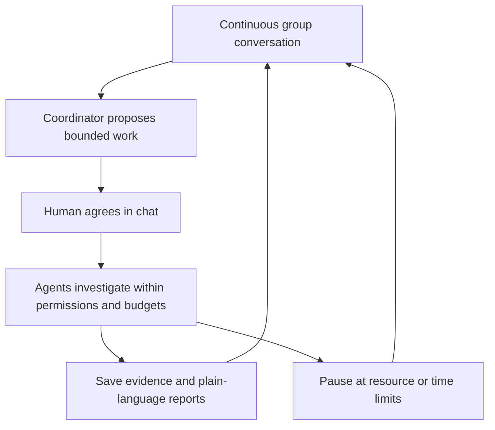

# LabCouncil

**Share an idea. Let agents work. Keep the conversation going.**

LabCouncil is an open-source prototype for a personal research group with AI agents and a human researcher. The main interface is a continuous group chat: share an idea, discuss progress, add resources or constraints, and agree on work in the conversation. Agents save reports, tool results and failed attempts. The project retains its inputs, plans, evidence and discussion as work changes.

**Status: local group-chat platform with a tested two-round synthetic case.** The browser defaults to a Codex CLI research group (`gpt-6.1-sol`, `high`), with model and tool permissions initially off. The API retains its deterministic simulation default. Opt-in real-case and research modes use Codex CLI or DeepSeek Flash; research tools read arXiv abstracts, pinned GitHub READMEs and run a bounded in-house synthetic calculation. Arbitrary upstream experiments and sustained scientific iteration remain incomplete. Numerical checks cannot certify every model claim; see the [complete case record](reproductions/2026-10-06-complete-case/REPORT.md).

## Try the local meeting

From the repository root, with Python 3.11+ on Linux:

```bash
python3 -m labcouncil start
```

Open [http://127.0.0.1:8765](http://127.0.0.1:8765). Send an idea to create a group, then talk to it directly. Questions do not need a meeting mode. Clear work instructions proceed within existing permissions and budgets. Tentative ideas become a coordinator proposal; agree or revise it in conversation. Say “暂停一下” or “恢复工作” to control new task starts. Resources, time and requirements can be added in chat; explicit permission statements such as “允许模型调用” are repeated for agreement before execution. Reports and original evidence open from message attachments. Click the LabCouncil character/name for activity, context and settings; the clock button opens activity. A new group's optional ellipsis menu selects the executor.

[运行说明](docs/RUNNING.md) covers service lifecycle, conversation controls and limitations. [持续群聊的执行约定](docs/CONTINUOUS-CHAT.md) explains evidence freshness, agreement, mid-step handover and failure records. Choose simulation in a new group's optional settings to test without model calls. Codex CLI reuses local `codex login`; DeepSeek uses the ignored local `.env`. Model calls may consume paid or account usage. Background requests remain bounded and are not retried automatically; conversation requests have no cumulative cap. Hard token, monetary and GPU budgets are not implemented. Earlier dated acceptance records document the interface that existed at the time, including its former meeting buttons and guided setup.

## The research loop



## What we want to build

- A project workspace with goals, tasks, artifacts, experiment history, and decisions.
- Research, execution, and review agents with explicit responsibilities and tools.
- Meetings grounded in saved evidence, with questions tied to individual claims or results.
- Confirmed meeting decisions that update task priorities and research direction.
- Background execution with budgets, checkpoints, failure recovery, and progress tracking.

The initial focus is computational research that can be checked through documents, code, and reproducible experiments. Voice meetings, avatars, and physical laboratory integrations are later extensions.

## Documents

- [Dots 设计适配](docs/DOTS-DESIGN.md): official references, continuous chat, real activity records and current capability limits; [local UI acceptance](reproductions/2026-10-07-dots-ui/REPORT.md) and [three iteration rounds](reproductions/2026-10-07-dots-iterations/REPORT.md).
- [Codex CLI 后台验收](reproductions/2026-10-07-codex-backend/REPORT.md): real two-round planning, saved experiment evidence and meeting Q&A with `gpt-6.1-sol / high`.
- [测评分数卡](docs/SCORECARD.md): transparent 0–100 scores from saved runs, with separate unmeasured capabilities and public benchmark candidates.
- [现有测评：题目、结果与缺口](docs/EVALUATION.md): inspect the two synthetic tasks, twelve runs, meeting cases and platform tests without confusing workflow checks with research quality.
- [微信群聊式界面验收](reproductions/2026-10-07-group-chat/REPORT.md): role avatars, guided setup, evidence attachments and a complete two-round simulation workflow.
- [聊天界面验收](reproductions/2026-10-07-chat-ui/REPORT.md): two-round browser workflow, durable drafts, retained discussion and simulation-only checks.
- [三步产品流程 / Product flow](docs/PRODUCT.md): the user-confirmed loop and current implementation boundaries.
- [实施计划 / Project plan](docs/PLAN.md): scope, architecture, milestones, and acceptance criteria.
- [本地运行 / Running](docs/RUNNING.md): start the platform, select simulation or real case, and understand its limits.
- [持续工作清单](docs/WORKLIST.md): all candidates, remaining validation, and the platform delivery sequence.
- [研究参考 / Research references](docs/REFERENCES.md): relevant repositories, papers, results, and limitations.
- [复现与采用规则 / Reproduction](docs/REPRODUCTION.md): evidence levels, validation gates, and experiment records.
- [首轮采用决定 / Adoption](docs/ADOPTION.md): what the recorded evidence supports and what remains unverified.
- [InternAgentS 实际试用](reproductions/2026-10-06-internagents-runtime/REPORT.md): real DeepSeek Flash computation, restart persistence, approval-forwarding failure, and budget limits.
- [开发协作 / Contributing](CONTRIBUTING.md): how to contribute while the design is being established.

## 中文简介

LabCouncil 已有本地持续研究群聊。直接发送 idea 建群，再在同一个对话中讨论、补充资源、明确授权、交代工作或反馈。界面参考 Dots：点名称或头像查看活动、上下文与设置，专业角色把进展和报告发回群里。网页新群默认 Codex CLI / gpt-6.1-sol / high，权限初始关闭；程序演示无需 key。既有输入、规划、证据、失败和讨论持续保留。当前研究工具能读公开摘要和固定提交 README、运行受控合成计算；任意仓库执行、完整论文实验复现和长周期自主研究尚未完成。

核心目标是验证：**人工组会能否让 agent 的下一轮工作更符合研究意图，并持续产出可检查的新证据。**

Upstream projects remain candidates. We will record reproducible checks and their limitations before selecting integrations. Published results are author-reported until independently checked; see the [initial audit](reproductions/2026-10-04-initial-audit/REPORT.md).

## Minimal Gemini connectivity check

The [first API check](reproductions/2026-10-04-gemini-connectivity/REPORT.md) passed. This verifies one fixed text response, not an agent workflow or scientific result.

Copy `.env.example` to a local `.env` and fill `GEMINI_API_KEY`. The `.env` file is excluded from Git. Run from the repository root:

```bash
python3 reproductions/check_gemini_connectivity.py --output logs/gemini-check-01.json
```

This makes one potentially billable request to `gemini-3.8-flash`, with no automatic retries. Use a new output filename for each attempt. The local simulation app is separate from this connectivity check.

## Minimal DeepSeek connectivity check

Subsequent validation will use `deepseek-flash` at the user's request. Both the initial Pro check and the corrected Flash check passed; see the [DeepSeek API record](reproductions/2026-10-04-deepseek-connectivity/REPORT.md). Put `DEEPSEEK_API_KEY` and `DEEPSEEK_MODEL` in the local `.env`, then run:

```bash
python3 reproductions/check_deepseek_connectivity.py --output logs/deepseek-check-01.json
```

This makes one potentially billable request with thinking disabled and no automatic retries. Use a new output filename for each attempt. This connectivity check alone does not test agent behavior, establish a quality advantage, or validate any upstream paper.

## Bounded real-model workflow validation

The [two-round workflow record](reproductions/2026-10-04-deepseek-workflow/REPORT.md) includes real DeepSeek Flash tool calls, saved CSV evidence, numerical report validation, and a prewritten review fixture that changes the next experiment. The original reviewer skipped verification; the revised harness forces tool execution. All failures and protocol changes are retained. This is our own functional harness, not an upstream framework or paper reproduction, and not a real human meeting.

```bash
python3 reproductions/check_deepseek_workflow.py first --output-dir logs/my-workflow
python3 reproductions/check_deepseek_workflow.py continue --output-dir logs/my-workflow
```

Use a fresh directory and configure the local `.env`. Each experiment has a shared limit of 12 API request attempts; requests may be billable. This harness is separate from the M1 simulation UI and its limited scheduling/recovery. Arbitrary code execution is not implemented. Real-model platform integration is separately recorded in the [complete case](reproductions/2026-10-06-complete-case/REPORT.md).

## Pinned upstream meeting check

The [Virtual Lab meeting-function record](reproductions/2026-10-04-virtual-lab-meeting/REPORT.md) runs two real meetings using unchanged pinned upstream source and a DeepSeek connection adapter. Speaking order, saved files, prior-summary input and updated plans were checked. Strict output-format attempts failed; the saved outputs passed offline reassessment under an explicit Markdown/JSON adapter contract. The original failures remain public. This changed-model check does not reproduce the paper's research results or select Virtual Lab as our backend.

## Shanghai AI Lab component checks

The [InternAgent AutoDebug record](reproductions/2026-10-06-internagent-autodebug/REPORT.md) includes two original baseline runs and a real DeepSeek Flash connection through the original Claude runner. It does not validate an autonomous discovery loop.

The [SCP record](reproductions/2026-10-06-scp-minimal/REPORT.md) verifies original SDK discovery/calls through stdio and local HTTP using a small custom tool. Initial failures and execution-environment controls are retained. Hosted resources and permissions remain unverified.

## License

MIT. See [LICENSE](LICENSE).

## Further upstream checks

The [freephdlabor real-agent record](reproductions/2026-10-04-freephdlabor-agent/REPORT.md) includes actual TCP intervention, fresh-process memory loading, bounded continuation, an abnormal exit, incremental backup, and duplicate-experiment checks. Intervention changed the next tool call, but restoration lost execution state and broke full memory serialization; incomplete disconnected input blocked. It is not selected as the platform backend.

The [Virtual Lab individual-meeting supplement](reproductions/2026-10-04-virtual-lab-meeting/REPORT.md) preserves source criticism into the saved follow-up summary. Separate semantic inspection found an invalid proposal to reuse one seed's baseline score across other seeds. Preserving criticism does not establish scientific correctness.

The [historical-source audit](reproductions/2026-10-04-source-mapping/REPORT.md) distinguishes the paper-era Assistants interface from the newer Chat Completions implementation. The [controlled comparison](reproductions/2026-10-05-comparison/REPORT.md) contains 12 real runs across single-agent, multi-agent, and actual user-review conditions; its small synthetic tasks do not establish general scientific superiority.

研究模式由真实Flash逐步规划、读取资料并准备组会。[首轮记录](reproductions/2026-10-06-research-loop/REPORT.md)保留早期失败；[恢复验收](reproductions/2026-10-06-network-recovery/REPORT.md)实际取得论文摘要和固定commit README。网络仍可能中断：明确勾选后，每个URL全项目最多三次连接尝试，每次单独记账；不重试模型请求。尚未接入完整论文复现实验。

最终组会报告现可综合保存的来源与工具证据，逐条列发现、验证边界和依据链接，并复用前轮材料。[综合报告验收](reproductions/2026-10-07-meeting-synthesis/REPORT.md)保留截断失败、跨轮成功、语义纠错和连接失败；最新提示的完整真实复验仍待完成。

[工作量控制](docs/WORKLOAD-CONTROL.md) separates resource limits from evidence and research outcomes; round duration is an input budget, not a measure of completed research.
