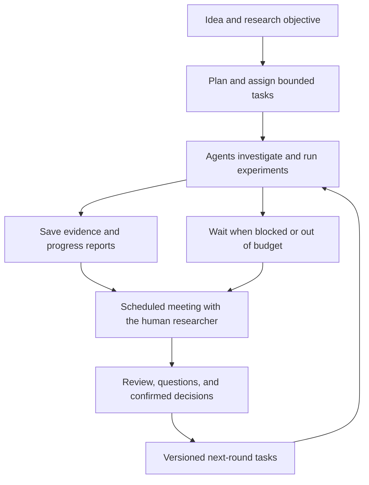

# LabCouncil

**Your ideas. An agent research team. A meeting where you steer the next experiment.**

LabCouncil is a planned, open-source platform for personal research groups made up of AI agents and a human researcher. Submit an idea, let agents investigate and produce evidence, meet on a schedule to review their reports, and turn your decisions into the next round of work.

**Status: planning stage.** This repository currently contains the project plan and research references. There is no runnable application yet.

## The research loop



## What we want to build

- A project workspace with goals, tasks, artifacts, experiment history, and decisions.
- Research, execution, and review agents with explicit responsibilities and tools.
- Meetings grounded in saved evidence, with questions tied to individual claims or results.
- Confirmed meeting decisions that update task priorities and research direction.
- Background execution with budgets, checkpoints, failure recovery, and progress tracking.

The initial focus is computational research that can be checked through documents, code, and reproducible experiments. Voice meetings, avatars, and physical laboratory integrations are later extensions.

## Documents

- [实施计划 / Project plan](docs/PLAN.md): scope, architecture, milestones, and acceptance criteria.
- [研究参考 / Research references](docs/REFERENCES.md): relevant repositories, papers, results, and limitations.
- [复现与采用规则 / Reproduction](docs/REPRODUCTION.md): evidence levels, validation gates, and experiment records.
- [开发协作 / Contributing](CONTRIBUTING.md): how to contribute while the design is being established.

## 中文简介

LabCouncil 是一个正在规划的个人虚拟研究组平台。你提供 idea；agent 团队开展调研和实验，保存结果与证据；你定期开组会、追问并评审；确认后的决定变成下一轮任务，agent 会后继续工作。

核心目标是验证：**人工组会能否让 agent 的下一轮工作更符合研究意图，并持续产出可检查的新证据。**

Upstream projects remain candidates. We will record reproducible checks and their limitations before selecting integrations. Published results are author-reported until independently checked; see the [initial audit](reproductions/2026-10-04-initial-audit/REPORT.md).

## Minimal Gemini connectivity check

The [first API check](reproductions/2026-10-04-gemini-connectivity/REPORT.md) passed. This verifies one fixed text response, not an agent workflow or scientific result.

Copy `.env.example` to a local `.env` and fill `GEMINI_API_KEY`. The `.env` file is excluded from Git. Run from the repository root:

```bash
python3 reproductions/check_gemini_connectivity.py --output logs/gemini-check-01.json
```

This makes one potentially billable request to `gemini-3.8-flash`, with no automatic retries. Use a new output filename for each attempt. No runnable platform exists yet.

## Minimal DeepSeek connectivity check

Subsequent validation will use `deepseek-flash` at the user's request. Both the initial Pro check and the corrected Flash check passed; see the [DeepSeek API record](reproductions/2026-10-04-deepseek-connectivity/REPORT.md). Put `DEEPSEEK_API_KEY` and `DEEPSEEK_MODEL` in the local `.env`, then run:

```bash
python3 reproductions/check_deepseek_connectivity.py --output logs/deepseek-check-01.json
```

This makes one potentially billable request with thinking disabled and no automatic retries. Use a new output filename for each attempt. Agent behavior has not been tested yet; this provider choice does not establish a quality advantage or validate any upstream paper.

## License

MIT. See [LICENSE](LICENSE).
