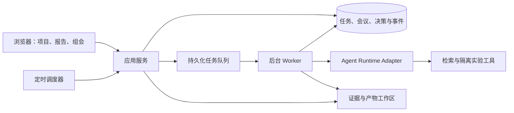

# LabCouncil 实施计划

创建日期：2026-10-04（Asia/Shanghai）

状态：已有本地平台、受控真实计算案例和版本化三步循环；通用研究执行器尚未完成。2026-10-06 按用户确认的产品流程重新对齐，详见 [产品流程](PRODUCT.md)。

持续跟进的候选、未复现范围与下一步顺序见 [WORKLIST.md](WORKLIST.md)。上海 AI Lab 的调查不替代原有候选验证，也不替代平台原型开发。

## 1. 产品目标

让个人研究者在同一个项目中反复完成三步：设定 idea、可调用资源、权限、每天固定工作时段和额外要求；agent 据此规划、调研、复现、整理数据并在后台迭代；用户选择开组会审查报告，再回到五项输入开启下一轮。项目目标、规划、来源、实验、报告、失败和决定持续保留。

界面围绕这三步组织。主界面突出本轮目标、规划、通俗报告和“开组会”；角色、原始数据、调用明细与技术设置按需展开。不以装饰、头像或复杂仪表盘增加用户负担。

主要用户是提出问题、判断证据、决定方向的人类研究者。协调 agent 负责拆解和跟踪任务，人类保留研究目标和关键方向的决定权。

需要验证的核心假设：周期性的人工 review 能减少方向偏移和重复实验，提高有效证据的产出，而不会使研究者承担过高的监督负担。

## 2. 第一版范围

### 包含

- 一个用户、一个研究项目、三个专业角色和一个协调角色。
- 文献与文件调研，以及可复现的代码、数据分析和小规模计算实验。
- 文字组会、定时准备报告、手动开始组会、针对报告的互动问答。
- 将讨论建议整理成可编辑的决策清单，由用户确认后派发。
- 会后继续工作；预算限制、任务暂停、重试和进程重启后的恢复。
- 每条报告结论关联来源、代码、实验日志或结果文件。

### 后续扩展

语音、自动幻灯片、虚拟头像、多用户、多项目资源分配、真实设备接入。首版不以自动写出可发表论文为验收目标。

## 3. 一个完整使用周期

1. **设定本轮。** 用户输入 idea、资源、权限、每日工作时段、额外要求。新项目记录第一版；已有项目从上轮继承，用户只修改需要调整的部分。资源包括已接入的模型、调用额度、计算环境、数据、论文和仓库；列出资源不等于授权全部操作。
2. **后台工作与报告。** agent 根据资源和时间选择任务颗粒度，制定可追溯规划，探索相关论文和仓库，先复现再采用，整理实验数据，并在约束内自动 loop。每日时段外不启动新任务；已开始的工作收尾并保存。缺权限、额度不足或没有有效下一步时等待。报告先用大白话说“做了什么、发现什么、还有什么没做、需要决定什么”，再提供来源和实验细节。
3. **开组会并重新设定。** 用户选择开组会，审查当时的报告和证据、追问，再进入同一套五项输入页。保存草稿不启动任务；确认后生成下一版输入与规划，继续后台工作。历史上下文持续保留，重复确认不重复派单。

当前已经实现五项输入、版本保存、每日时段与已接入工具权限的启动检查，以及组会返回输入页的闭环。执行计划仍由固定计算执行器生成，不根据任意资源自主规划；论文／仓库探索、自由实验实现和持续研究 loop 尚未接入。不能把网页流程演示当成第2步科研能力已完成。旧案例没有五项输入时标记为兼容默认值，不改写历史快照。

定时组会只准备材料；每日工作时段与组会时间是两个独立设置。系统不会假设用户在线，也不会代替用户确认下一轮。

## 4. 角色与交付物

| 角色 | 职责 | 交付物 |
| --- | --- | --- |
| Coordinator | 拆解问题、跟踪依赖、调度、准备议程和决策草稿 | 任务清单、进展摘要、下一步提案 |
| Researcher | 查找已有工作、整理来源、明确研究假设 | 文献笔记、可检验假设、来源链接 |
| Executor | 编写和运行实验、分析数据、记录失败 | 代码版本、配置、原始结果、日志、图表 |
| Reviewer | 检查假设与方法、尝试复现、寻找替代解释 | 证据缺口、复现结果、需要补做的验证 |

角色不代表必须同时常驻四个模型进程。按任务唤醒角色，避免空转。首版优先采用明确的任务调度和依赖关系，动态重规划通过新任务版本完成。

## 5. 数据与证据

建议的核心对象：

| 对象 | 必需信息 |
| --- | --- |
| Project | 目标、范围、工作假设、预算、当前计划版本 |
| Task | 指令、角色、依赖、状态、验收条件、计划版本 |
| Run | 所属任务、运行版本、工具调用、费用、重试、检查点 |
| Artifact | 路径、类型、内容摘要、内容哈希、产生它的 Run |
| Claim | 结论、关联证据、验证状态、适用条件 |
| Meeting | 时间、报告快照、参与角色、讨论记录、决策状态 |
| Decision | 确认人、时间、理由、受影响任务、取代的计划版本 |

重要结论必须区分：已观察结果、未经验证的假设、失败结果和未知项。无法关联证据的结论在报告中标记为未验证。

文献、数据、代码与失败记录保存在工作区；agents 通过引用文件和对象 ID 传递信息。压缩后的对话只负责导航，原始证据不随摘要删除。

## 6. 运行与会议的一致性

任务状态：`queued → running → completed / failed / blocked / paused / cancelled`。失败重试创建新的 Run，保留历史记录；重试超过配置上限后停止。

会议状态：`scheduled → preparing → ready → in_review → decisions_pending → closed`。

组会报告使用固定快照。正在进行的实验可以继续，但会议中明确显示结果截止时间和仍在运行的任务。用户改变方向后：

- 生成新的计划与任务版本。
- 不再启动被取代的排队任务。
- 对正在执行的旧任务请求在安全边界停止；允许不可即时中断的操作结束并保存结果。
- 旧版本结果保留为历史证据，不能自动作为新计划的验收结果。

只有确认的 Decision 能发布下一轮计划。重复提交同一决策不会重复派单。

## 7. 初步架构



初步选择是轻量 Web 界面、Python 应用与 worker、SQLite 元数据和文件工作区。多 worker 或远程部署需求成立后再考虑 PostgreSQL 与独立队列。

Agent Runtime Adapter 提供运行、事件读取、干预、取消和恢复接口。先做候选框架的复现和记录，再决定是否集成。可重复的模拟运行仅用于界面与状态流程开发，不能作为上游功能或科研效果的验证。首轮验证按用户选择使用 DeepSeek Flash；框架后端尚未确定。

后台 worker 与浏览器生命周期分离。持久化任务需具备租约、心跳、重复执行检测和恢复策略。外部实验工具的运行 ID 要被保存，以便进程重启后查询已有任务，避免重复提交实验。

模型费用和实验计算时间分别计量。每次调用前检查剩余预算；达到上限不再调度下一步。会议问答预算独立于后台研究预算。

实验在独立工作目录和隔离执行环境中运行。工具访问范围由项目配置确定，密钥保存在运行环境中，不写入公开产物和日志。未经任务授权的外部发布不能由研究 agent 自行执行。

## 8. 分阶段交付与验收

### M0：计划与研究参考

- [x] 确定项目名 LabCouncil。
- [x] 写入项目定位、计划和参考资料。
- [x] 建立并验证 public GitHub 仓库：[siddhartha-yz/labcouncil](https://github.com/siddhartha-yz/labcouncil)。

### M0.5：复现与采用决定

- [x] 建立分层证据、运行记录和采用规则，见 [REPRODUCTION.md](REPRODUCTION.md)。
- [x] 固定 Virtual Lab 与 freephdlabor 的代码 commit，记录环境预检与失败尝试。
- [x] 使用 DeepSeek Flash 完成自有受控工具工作流验证，记录真实模型失败、程序修订和固定评审输入的影响；见 [工作流记录](../reproductions/2026-10-04-deepseek-workflow/REPORT.md)。这不代替下列上游最小示例或科研结果复现。
- [x] 使用固定上游 Virtual Lab 会议入口，验证两场会议编排、保存、摘要读入与计划变化，保留格式失败和修订；[记录与暂不采用决定](../reproductions/2026-10-04-virtual-lab-meeting/REPORT.md)。模型条件已改变，未复现论文结论。
- [x] 运行真实 freephdlabor 基础 agent 与 TCP 干预，检查独立进程恢复、原增量备份、异常退出和重复实验；[记录与暂不采用决定](../reproductions/2026-10-04-freephdlabor-agent/REPORT.md)。未运行完整官方 launcher。
- [x] 补齐 Virtual Lab 一对一来源质疑传递，并由 Codex 逐句复核识别不正确的跨 seed 固定基线建议；机械通过不等于科研方法正确。
- [x] 核对论文版本与最初公开代码，登记可检验主张；[版本审计](../reproductions/2026-10-04-source-mapping/REPORT.md)。Zenodo 冻结存档哈希未取得，原论文结果保持未复现。
- [x] 完成首轮官方入口尝试和预注册功能检查，保留原接口404、原CLI模型名拒绝、恢复错误及输入断开负结果；新版会议和基础agent不是完整科研系统。原论文R3仍未复现。
- [x] 完成两个计算任务、每项两次重复、三种流程的等上限预算比较，并接收用户真实反馈；[记录](../reproductions/2026-10-05-comparison/REPORT.md)。实际人工时间未提供，费用仅记录 usage，不声称完整成本效率。
- [x] 写明通过项、恢复/方法负结果、原版本接口失败、未验证范围和暂不直接采用两个候选后端的理由；不作为论文结果复现。

验收：每个拟集成模块有固定版本、可重复命令、原始输出与限制说明。组件检查不等于系统复现，系统可运行不等于论文结果复现，期刊声誉不替代本地验证。资源不足时保持未验证，不默认通过。

M1 的模拟界面开发可以独立进行；真实后端的集成须通过 M0.5 对应模块的功能验证，并记录科研效果尚未验证的范围。

新增候选进展：上海 AI Lab 源码审计与 InternAgentS 最小运行已记录；后者连续审批转发和预算未通过。InternAgent 基线与 Flash 后端连接、SCP 自有小工具的 stdio/HTTP 路径已分别验证，完整发现循环、科学资源和端砚仍未验证，详见持续清单，不计为整套已采用。

### M1：验证完整流程的本地原型

- [x] 创建项目和任务；浏览任务状态、报告及证据。
- [x] 使用模拟 agents 完成一轮后台工作。
- [x] 手动开始组会、针对报告追问、编辑并确认决策。
- [x] 决策触发下一轮任务，重复确认不会重复执行。

验收：一个模拟项目完成两轮工作和一次组会；报告快照、确认决策与新任务可以相互追溯。模拟产物明确标注来源，不混同真实研究结果。

实际验收：[M1 原型记录](../reproductions/2026-10-06-m1-prototype/REPORT.md)、[运行说明](RUNNING.md)。已实现 Linux 独立 worker、SQLite 状态、单次定时材料和草稿保存；这些仅针对模拟任务，不提前完成 M2/M3 的真实工具与恢复验收。

### M2：接入真实研究工具

部分进展：[真实 Flash 完整合成案例](../reproductions/2026-10-06-complete-case/REPORT.md)已经走通两轮、定时快照、一次真实问答、工程 fixture 确认、独立数值复算与正常重启。13 次实际请求，次数硬上限生效；计算和复核角色仍误述输入场景。不能因数值通过就勾选“结论可靠”或整个 M2。尚缺实际用户科研评审、检索、隔离执行、费用硬预算与外部实验故障恢复。

- [ ] 接入一个模型供应商、文件检索、文献检索及隔离的代码执行。
- [ ] 三个专业角色按任务运行；报告中的结论引用真实证据。
- [ ] 保存代码、配置、数据来源、指标和失败日志。
- [ ] 实现调用与计算预算、任务失败和停止条件。

验收：用一个小规模计算问题完成真实实验；Reviewer 从保存的代码和配置复现至少一项关键结果；用户的组会决策导致实际的下一轮实验变化。

### M3：定时会议与恢复

- [ ] 按用户时区准备会议材料，显示待审事项和仍在运行的工作。
- [ ] 实现会议提醒、预算耗尽等待与阻塞通知。
- [ ] 在 worker 重启后恢复任务、证据、会议和已确认决策。
- [ ] 验证旧版本任务取消、运行中干预和外部任务重新连接。

验收：关闭浏览器不影响后台任务；重启 worker 不重复提交实验或确认过的任务；错过组会时报告保持可读，尚未决定的工作保持等待。

### M4：评估平台是否有用

- [ ] 对同类任务比较：无组会、定期组会、随时人工干预。
- [ ] 由用户选择至少三个代表性问题，记录模型、预算和计算条件。
- [ ] 独立检查关键结论，保存每次失败和方向调整的记录。
- [ ] 根据结果决定是否扩大到长周期项目、多项目或语音组会。

指标：可复现结果数量、有效证据产出、重复实验比例、方向偏移次数、采纳决策后的任务完成率、人工监督时间和总成本。小样本试用先用于发现问题，不据此声称普遍优于人类研究组。

## 9. 第一轮试验问题模板

```text
研究问题：
已有材料与数据来源：
可检验假设：
允许的工具与计算环境：
基线与评价指标：
本轮交付物：
模型费用预算 / 计算时间预算：
组会时间与时区：
停止条件：
需要人类决定的事项：
```

## 10. 尚需决定

- 第一个真实研究问题和学科领域。
- 实验使用本机、独立服务器还是现有 GPU 集群。
- 模型供应商、预算与可接受的人工监督频率。
- 组会提醒渠道；默认先在平台内显示待审状态。
- freephdlabor 等框架能否作为后端，或只借鉴其机制；需运行验证后决定。

这些选择不影响模拟界面开发，但会影响 M0.5 的真实运行与复现。当前优先执行复现，不因某项目获得关注或论文发表而直接采用。研究参考见 [REFERENCES.md](REFERENCES.md)。
