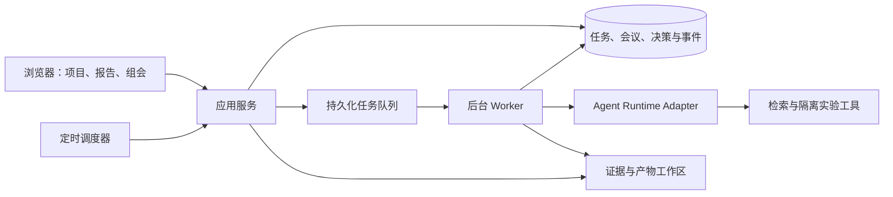

# LabCouncil 实施计划

创建日期：2026-10-04（Asia/Shanghai）

状态：规划中；尚未实现运行时、界面或调度服务。本文记录第一版假设，技术选型需要通过原型验证。

## 1. 产品目标

让个人研究者能够维护一个由 AI agents 组成的研究组：提交研究 idea，安排后台工作，定期阅读汇报并开展互动评审，将确认后的决定转成下一轮任务。

主要用户是提出问题、判断证据、决定方向的人类研究者。协调 agent 负责拆解和跟踪任务，人类保留研究目标和关键方向的决定权。

需要验证的核心假设：周期性的人工 review 能减少方向偏移和重复实验，提高有效证据的产出，而不会使研究者承担过高的监督负担。

## 2. 第一版范围

### 包含

- 一个用户、一个研究项目、三个专业角色和一个协调角色。
- 文献与文件调研，以及可复现的代码、数据分析和小规模计算实验。
- 文字组会、定时准备报告、手动开始组会、针对报告的互动问答。
- 将讨论建议整理成可编辑的决策清单，由用户确认后派发。
- 会后继续工作；预算限制、任务暂停、重试和进程重启后的恢复。
- 每条报告结论关联来源、代码、实验日志或结果文件。

### 后续扩展

语音、自动幻灯片、虚拟头像、多用户、多项目资源分配、真实设备接入。首版不以自动写出可发表论文为验收目标。

## 3. 一个完整使用周期

1. 用户提供 idea、已有材料、希望回答的问题、验收方式及预算。
2. 协调角色提出有限的任务集合；目标不清楚时先澄清，或标记工作假设。
3. 专业 agents 执行任务，记录尝试、失败、证据和产物。
4. 到达组会时间，系统生成版本固定的进展快照和报告；提醒用户进入会议。
5. 用户查看报告、打开证据、向指定角色追问；临时工具查询有单独预算。
6. 系统整理候选决策，用户编辑并确认。讨论中的猜测不会自动改变任务。
7. 决策更新任务版本、优先级、负责人和验收条件，后台开始下一轮工作。
8. 缺少必要信息、连续无进展、失败上限或预算耗尽时进入等待状态。

定时组会意味着准时准备材料和提醒；不会假设用户一定在线，也不会自动模拟用户同意。

## 4. 角色与交付物

| 角色 | 职责 | 交付物 |
| --- | --- | --- |
| Coordinator | 拆解问题、跟踪依赖、调度、准备议程和决策草稿 | 任务清单、进展摘要、下一步提案 |
| Researcher | 查找已有工作、整理来源、明确研究假设 | 文献笔记、可检验假设、来源链接 |
| Executor | 编写和运行实验、分析数据、记录失败 | 代码版本、配置、原始结果、日志、图表 |
| Reviewer | 检查假设与方法、尝试复现、寻找替代解释 | 证据缺口、复现结果、需要补做的验证 |

角色不代表必须同时常驻四个模型进程。按任务唤醒角色，避免空转。首版优先采用明确的任务调度和依赖关系，动态重规划通过新任务版本完成。

## 5. 数据与证据

建议的核心对象：

| 对象 | 必需信息 |
| --- | --- |
| Project | 目标、范围、工作假设、预算、当前计划版本 |
| Task | 指令、角色、依赖、状态、验收条件、计划版本 |
| Run | 所属任务、运行版本、工具调用、费用、重试、检查点 |
| Artifact | 路径、类型、内容摘要、内容哈希、产生它的 Run |
| Claim | 结论、关联证据、验证状态、适用条件 |
| Meeting | 时间、报告快照、参与角色、讨论记录、决策状态 |
| Decision | 确认人、时间、理由、受影响任务、取代的计划版本 |

重要结论必须区分：已观察结果、未经验证的假设、失败结果和未知项。无法关联证据的结论在报告中标记为未验证。

文献、数据、代码与失败记录保存在工作区；agents 通过引用文件和对象 ID 传递信息。压缩后的对话只负责导航，原始证据不随摘要删除。

## 6. 运行与会议的一致性

任务状态：`queued → running → completed / failed / blocked / paused / cancelled`。失败重试创建新的 Run，保留历史记录；重试超过配置上限后停止。

会议状态：`scheduled → preparing → ready → in_review → decisions_pending → closed`。

组会报告使用固定快照。正在进行的实验可以继续，但会议中明确显示结果截止时间和仍在运行的任务。用户改变方向后：

- 生成新的计划与任务版本。
- 不再启动被取代的排队任务。
- 对正在执行的旧任务请求在安全边界停止；允许不可即时中断的操作结束并保存结果。
- 旧版本结果保留为历史证据，不能自动作为新计划的验收结果。

只有确认的 Decision 能发布下一轮计划。重复提交同一决策不会重复派单。

## 7. 初步架构



初步选择是轻量 Web 界面、Python 应用与 worker、SQLite 元数据和文件工作区。多 worker 或远程部署需求成立后再考虑 PostgreSQL 与独立队列。

Agent Runtime Adapter 提供运行、事件读取、干预、取消和恢复接口。先用可重复的模拟运行验证完整流程，再比较自建运行时和已有开源框架。具体模型供应商与框架尚未确定。

后台 worker 与浏览器生命周期分离。持久化任务需具备租约、心跳、重复执行检测和恢复策略。外部实验工具的运行 ID 要被保存，以便进程重启后查询已有任务，避免重复提交实验。

模型费用和实验计算时间分别计量。每次调用前检查剩余预算；达到上限不再调度下一步。会议问答预算独立于后台研究预算。

实验在独立工作目录和隔离执行环境中运行。工具访问范围由项目配置确定，密钥保存在运行环境中，不写入公开产物和日志。未经任务授权的外部发布不能由研究 agent 自行执行。

## 8. 分阶段交付与验收

### M0：计划与研究参考

- [x] 确定项目名 LabCouncil。
- [x] 写入项目定位、计划和参考资料。
- [ ] 建立并验证 public GitHub 仓库。

### M1：验证完整流程的本地原型

- [ ] 创建项目和任务；浏览任务状态、报告及证据。
- [ ] 使用模拟 agents 完成一轮后台工作。
- [ ] 手动开始组会、针对报告追问、编辑并确认决策。
- [ ] 决策触发下一轮任务，重复确认不会重复执行。

验收：一个模拟项目完成两轮工作和一次组会；报告快照、确认决策与新任务可以相互追溯。模拟产物明确标注来源，不混同真实研究结果。

### M2：接入真实研究工具

- [ ] 接入一个模型供应商、文件检索、文献检索及隔离的代码执行。
- [ ] 三个专业角色按任务运行；报告中的结论引用真实证据。
- [ ] 保存代码、配置、数据来源、指标和失败日志。
- [ ] 实现调用与计算预算、任务失败和停止条件。

验收：用一个小规模计算问题完成真实实验；Reviewer 从保存的代码和配置复现至少一项关键结果；用户的组会决策导致实际的下一轮实验变化。

### M3：定时会议与恢复

- [ ] 按用户时区准备会议材料，显示待审事项和仍在运行的工作。
- [ ] 实现会议提醒、预算耗尽等待与阻塞通知。
- [ ] 在 worker 重启后恢复任务、证据、会议和已确认决策。
- [ ] 验证旧版本任务取消、运行中干预和外部任务重新连接。

验收：关闭浏览器不影响后台任务；重启 worker 不重复提交实验或确认过的任务；错过组会时报告保持可读，尚未决定的工作保持等待。

### M4：评估平台是否有用

- [ ] 对同类任务比较：无组会、定期组会、随时人工干预。
- [ ] 由用户选择至少三个代表性问题，记录模型、预算和计算条件。
- [ ] 独立检查关键结论，保存每次失败和方向调整的记录。
- [ ] 根据结果决定是否扩大到长周期项目、多项目或语音组会。

指标：可复现结果数量、有效证据产出、重复实验比例、方向偏移次数、采纳决策后的任务完成率、人工监督时间和总成本。小样本试用先用于发现问题，不据此声称普遍优于人类研究组。

## 9. 第一轮试验问题模板

```text
研究问题：
已有材料与数据来源：
可检验假设：
允许的工具与计算环境：
基线与评价指标：
本轮交付物：
模型费用预算 / 计算时间预算：
组会时间与时区：
停止条件：
需要人类决定的事项：
```

## 10. 尚需决定

- 第一个真实研究问题和学科领域。
- 实验使用本机、独立服务器还是现有 GPU 集群。
- 模型供应商、预算与可接受的人工监督频率。
- 组会提醒渠道；默认先在平台内显示待审状态。
- freephdlabor 等框架能否作为后端，或只借鉴其机制；需运行验证后决定。

这些选择不影响先实现 M1 的流程原型。研究参考见 [REFERENCES.md](REFERENCES.md)。
