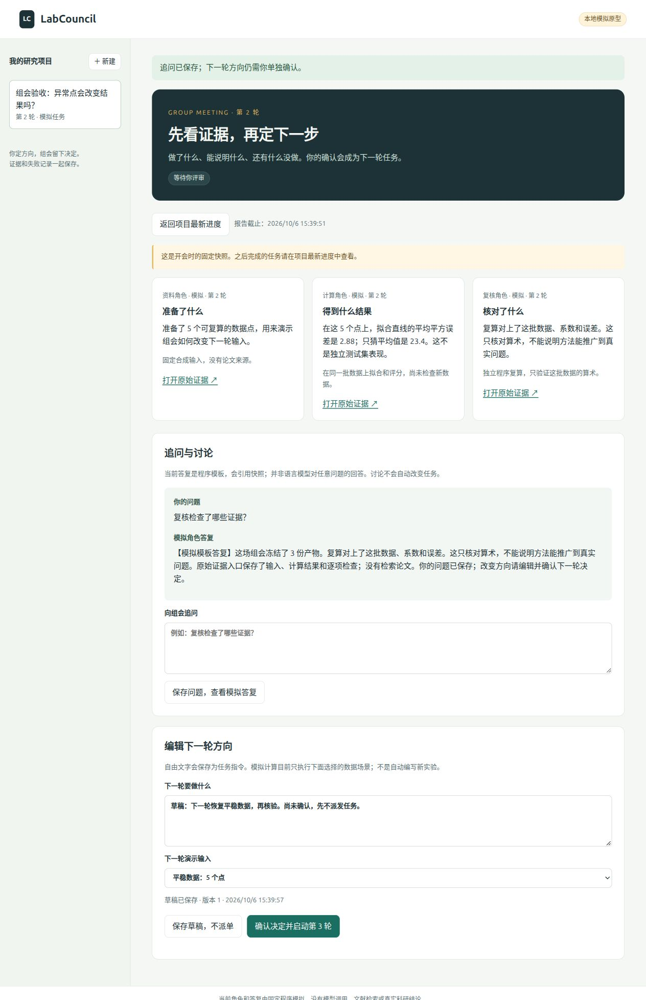

# M1：本地组会流程已能运行，研究角色仍是模拟

日期：2026-10-06，Asia/Shanghai。应用入口见 [运行说明](../../docs/RUNNING.md)。

你现在可以新建项目，等待后台报告，打开证据，进入组会追问，保存下一轮草稿，最后确认方向并让后台继续。网页报告先解释做了什么、发现什么和不能说明什么。

**这是固定程序的工程原型，不是自主科研系统。** 没有调用模型、读 API key、检索文献或执行任意实验。自由文字 idea/方向会保存，计算只处理所选的两种五点输入。模板问答明确标注来源。

## 实际网页验收

Codex 操作实际浏览器完成以下步骤；这些输入是工程验收 fixture，不是用户真实科研评审，不计入人工监督时间或前一轮12次比较。

1. 创建“组会验收：异常点会改变结果吗？”项目，平稳数据第一轮完成三份产物。
2. 打开固定组会快照并追问，确认“加入一个异常点；比较误差变化，并独立复算。只报告这个例子。”第二轮由独立 worker 执行，得到另三份产物。
3. 关闭之前的预览页面后，后台任务仍完成；重新打开后看到第二轮结果。随后重新启动服务并再次检查。
4. 打开第二轮组会，保存“草稿：下一轮恢复平稳数据，再核验。尚未确认，先不派发任务。”刷新页面重新打开，文字和所选场景仍在。
5. 再次追问“复核检查了哪些证据？”，草稿仍在，项目保持第2轮，没有自动生成第三轮。
6. 实际执行 `stop → start → status`；重启前后的完整项目与两场组会 JSON 完全一致。网页与 worker 正常运行，数据库保留。

公开状态：[project.json](project.json)、[第一轮组会](meeting-round-01.json)、[第二轮组会](meeting-round-02.json)、[重启检查](restart-check.json)。全为合成输入；数据库和进程日志仍留在忽略的本地目录。

## 结果能说明什么

| 场景 | 拟合直线 MSE | 只猜平均值 MSE | 复核 |
| --- | ---: | ---: | --- |
| 平稳五点 | 0 | 8 | 输入、系数、预测、MSE、MAE 与基线复算一致 |
| 最后一个点增加6 | 2.88 | 23.4 | 同上 |

拟合和评分用同一批五点，不是独立测试集，也不能说明一般模型优劣。复核角色使用与执行角色不同的求解公式，从已保存的原始数据重新算；测试故意提交 MSE=99 时，它检测到不一致。复核程序不是独立研究人员。

## 自动检查

实际本机 Python 3.11.10 和 3.14.4 各运行23项检查，全部通过。输出见 [Python 3.11](tests-python311.txt)、[Python 3.14](tests-python314.txt)。前端 `node --check` 通过。CI 也使用这两个 Python 系列，测试不需要模型凭据。

覆盖：两轮追溯、并发重复确认只派一次、旧版本拒绝、模拟预算调用前停止、暂停、租约恢复与旧 worker 写入拒绝、重试上限、晚到旧结果仅作历史、快照冻结、草稿持久化和冲突、证据不可修改、单次定时材料、独立进程恢复、错误结果复核、提交事务回滚、本机 HTTP 与请求来源检查、后台生命周期和不停止无关进程。

开发中保留在说明中的修正：最初在事务里切换 WAL 报错，改为初始化时设置；页面异步刷新可能覆盖组会视图，增加导航版本检查；刷新未确认方向会丢失，增加显式保存草稿；Python 3.14 资源检查发现初始化 SQLite 连接未关闭，改为显式关闭。最后版本重跑上述检查，无资源警告。开发失败不计为上游复现失败。

## 已实现的边界

- SQLite 存项目、版本化任务、不可变证据、组会快照、讨论、草稿、确认决定和事件。内容哈希用固定 UTF-8 JSON 格式，API 说明该格式。
- Linux `start` 启动独立网页和 worker；浏览器不是任务进程。`stop` 只操作带匹配实例标识的进程，保留状态。不是开机服务，也没有外部进程监督。
- 到设定时间生成一次材料快照；离线后重启补准备。没有循环日历、外部提醒或通知渠道。
- 后台角色和模板答复分别计模拟单位；不是 token 或费用。租约恢复可能重新执行一次模拟计算，只保证每任务一个提交结果，不能保证外部实验绝不重复。
- 开会时冻结报告，之后完成的工作在项目最新进度里查看。只有明确确认才生成下一轮；保存草稿和讨论均不派单。
- 仅监听127.0.0.1，限制请求来源和静态文件；未完成公网认证、数据库升级或长周期可靠性验收。

M1 验收通过。M2 真实模型与工具、真实用量硬限制及外部实验恢复仍待实现；真实科研质量和组会价值评估属于 M4。上海 AI Lab 的组件记录保持单独状态，不因本原型完成而自动采用。
