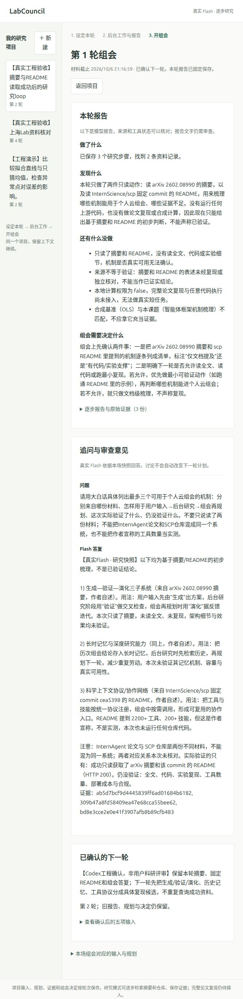

# 公开资料读取恢复与真实研究loop

这次平台实际读到了上海Lab的论文摘要和固定版本仓库README，真实Flash据此连续工作并回答了一次组会追问。没有执行上游代码，没有复现论文成绩。网络恢复后本次读取均第一次成功；有限重试的失败分支由离线故障注入验证，不能据此声称TUN问题已修复。

## 实际记录

| 验收 | 模型请求 | 公开HTTP | 结果 |
|---|---:|---:|---|
| 前置网络对比 | 0 | 6 | Python/curl各有成功和TLS EOF，没有稳定优胜客户端 |
| 独立来源组件 | 0 | 4/12 | 摘要、仓库元信息、commit、对应README均200；重启缓存重读新增请求0 |
| 真实Flash研究项目 | 后台6/6，组会1/1 | 4/12 | 读摘要→读README→准备组会，3份报告；1次真实追问；11,821已知tokens |

第二阶段实际共8次公开读取。两个数据库读取的4份原响应按URL比较，原始SHA256全部一致。人民币费用没有核验，token硬预算未实现。新项目独立计数，原035225...项目的12/1模型上限、12次既有尝试和4条失败来源记录未改变。

资料是 InternAgent-1.5（arXiv `2602.08990v1`）的摘要，以及 `InternScience/scp` commit `cea5398564032aea65a78e246d06c30ae945e03f` 的README。完整HTTP响应保存在忽略的本地数据库；适配器提供模型的摘要最多10,000字符、README最多16,000字符，后者确实截断。保存完整README的SHA256 `829f9609808d4f2c9d4e35dff8793dcfae3003ee02a548f0445437e7457e5dc3`；不是阅读了完整仓库或整篇论文。

公开工程记录：[组件](source-component.json)、[真实loop](loop.json)、[前4次比较](transport-comparison.json)、[最后2次比较](clean-curl-comparison.json)。loop导出保留输入、规划、模型报告、组会答复、证据标识和请求哈希，不重复公开完整来源原文与模型请求上下文。

## 失败恢复的具体边界

新权限 `retry_public_reads` 默认false；历史三项权限兼容读入时仍默认不重试，原历史输入不改写。明确开启时，同一URL整个项目最多3次尝试；每次在HTTP前原子占用并保留独立结果、连接方式、序号和耗时。连接EOF、重置、超时等已知瞬时错误可重试；HTTP错误、证书错误、started/unknown不重试。2秒退避；arXiv继续全局串行并保持3秒间隔。关闭重试后仍能读取之前第二/三次成功的缓存。

项目公开HTTP总上限建项目时可设0–24；包括失败、未知与重试。跨轮已成功操作不重做，同轮重复停止；新一轮明确允许重试时才可再检查前轮失败资料。模型请求仍不自动重试，不增加原额度。研究任务租约延长到5分钟，以容纳最多9次有界读取与2次模型请求。

用户确认TUN已启用。GNOME代理字段没有可用显式HTTP代理；DNS和TLS表现支持存在中转路径，但未受控验证唯一根因。没有修改系统代理、TUN、DNS、证书校验或代理进程。使用原urllib，没有因为一次成功就替换为curl。

## 报告能用到什么程度

Flash的阶段报告把摘要结论、README作者宣称和实际读取分开。人工检查README原文确有2200+工具、200+技能相关表述；本次没有验证这些数量。三个可借鉴候选是：先提出方案再核验并迭代、保留历史记忆、统一工具协议。这些是文档启发的设计建议，不是作者架构已复现的结论；InternAgent论文与SCP仓库也没有被当成同一系统。

仍发现产品缺口：准备组会的最终简报只总结“读了哪些资料”，具体机制清单要靠追问才给出。其report提示只提供当前prepare_meeting结果、没有汇总前两步原文；这是平台提供上下文的不足，不能全归因于模型。原报告原样保留，后续应将前轮证据和来源引用送入最终综合报告，再做真实复验。

本次追问由Codex工程验收提出；下一轮确认也明确标注工程确认，不冒充用户科研评审。确认后保留2轮输入、3份原报告、固定组会快照与1个决定；每日时段改为Asia/Shanghai 09:00–18:00，原模型额度耗尽，下一轮任务保持queued且不执行。这里只验证输入和历史保留，没有声称第二轮已继续研究。

## 复查

```bash
python3 reproductions/2026-10-06-network-recovery/audit_saved_run.py
python3 -W error::ResourceWarning -m unittest discover -s tests -v
node --check labcouncil/static/app.js
```

离线公开记录审计通过；Python3.11和3.14各61项测试通过（[3.11](tests-python311.txt)、[3.14](tests-python314.txt)）。覆盖显式授权、三次全项目限制、HTTP429/证书/未知不重试、额度中途耗尽保留证据、新版本隔离、旧数据库迁移和成功缓存跨权限读取。测试不是网络成功率或科学准确率的测量。

[run_source_component.py](run_source_component.py)会发真实公开请求，需从仓库根目录运行并使用新的不存在数据库；不要把离线审计当真实复跑。实际源组件用了simulation任务认领来避开模型调用门槛，仅直接调用公开来源适配器，没有执行模拟科研任务；两次确认仅用于缓存检查。

预览仍使用8965，数据库 `workspaces/pipeline-preview/state.sqlite3`。未新增端口。截图展示固定组会答复及下一轮确认：



接下来先让最终报告综合已有发现，再接入一个受控上游最小实验并独立核验。原候选、SCP本地SDK验收、InternAgentS恢复问题及端砚试用仍按[工作清单](../../docs/WORKLIST.md)推进，均不因本次文档读取成功而视为完成。
