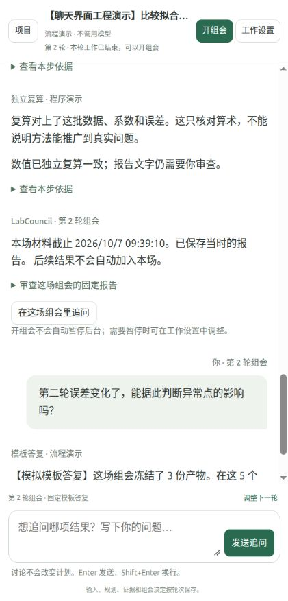

# 聊天式前端验收

2026-10-07。用户要求把前端改成聊天式，保留原五项输入与组会循环，避免非必要装饰。

## 实现

一个项目对应一条研究对话。首次在底部输入 idea，然后在对话内补充资源、权限、每日工作时间与额外要求，明确确认后创建项目。规划、各步报告、失败记录、组会快照、用户追问、答复和下一轮确认按保存时间展示。原始数据与调用账本仍可打开。

“开组会”固定当时材料；底部输入框追问本场报告。“调整下一轮”带入当前五项输入，可保存草稿、返回讨论、确认继续。追问不会自动改变计划。讨论和已确认的输入由原数据库保存；页面刷新恢复对话。未发送的追问只在当前页面内存保留，不承诺刷新恢复。

四秒轮询不替换输入框；保持编辑内容和焦点，阅读旧消息时保留滚动位置，保留展开的证据。工作设置移到弹窗，窄屏项目列表可折叠。没有新增前端依赖、模型调用接口或后台执行器。

## 实际检查

浏览器通过现有本机服务 `http://127.0.0.1:8965/`，新建工程演示项目，使用默认固定程序。项目 ID 与只读数据库核对见 [state-check.json](state-check.json)。

| 检查 | 观察 |
| --- | --- |
| 聊天输入 idea → 五项条件 → 确认 | 项目创建，输入与平台规划出现在对话里 |
| 后台结果自动加入 | 第一轮三个角色产物可见，明确标记程序演示 |
| 开组会 → 追问 → 答复 | 问题与固定模板答复按顺序保存 |
| 调整下一轮 | 资源、权限、每日时间、要求带入，没有清空上下文 |
| 保存草稿 | 仍为第一轮，界面显示草稿版本 1，没有开始下一轮 |
| 刷新 → 再次打开草稿 | 改后的 idea、异常点场景和其他条件恢复 |
| 确认下一轮 | 第二轮启动，第一轮报告、讨论与决定仍可见 |
| 第二轮后台完成 | 两轮共六份角色产物，第二轮误差 2.88 / 23.4 |
| 第二轮组会与键盘发送 | Enter 发送追问，第二条模板答复保存 |
| 编辑时自动轮询 | 追问文字与输入焦点保留 |
| 窄屏与 1200px 宽屏 | 导航、输入框、设置入口可用；DOM 检查无横向溢出；临时宽度设置已恢复 |
| 工作设置 | 弹窗显示累计额度、暂停选项、原定时值与调用明细 |
| HTTP 回归 | `python3 -m unittest discover -s tests -p test_http.py -v`，5 项通过 |
| JS / 变更格式 | `node --check labcouncil/static/app.js` 和 `git diff --check` 通过 |

最终只读核对：轮次 2，任务 6、产物 6、组会 2、确认决定 1、讨论 2；模型请求 0、外部来源请求 0。这里只改变新建的模拟工程项目，已有真实研究项目用于读取展示，没有给它们提交下一轮方向或追加模型请求。

测试开始时，沙箱不允许 HTTP 测试绑定本机端口；同一组测试在允许本机端口后通过。没有修改系统网络或代理设置。

## 范围

这是前端与现有流程的工程验收，不是模型科研能力测评、用户科研评审或公开研究基准成绩。真实项目的报告原文照常显示，没有改写历史证据；本次没有消耗模型 API。
