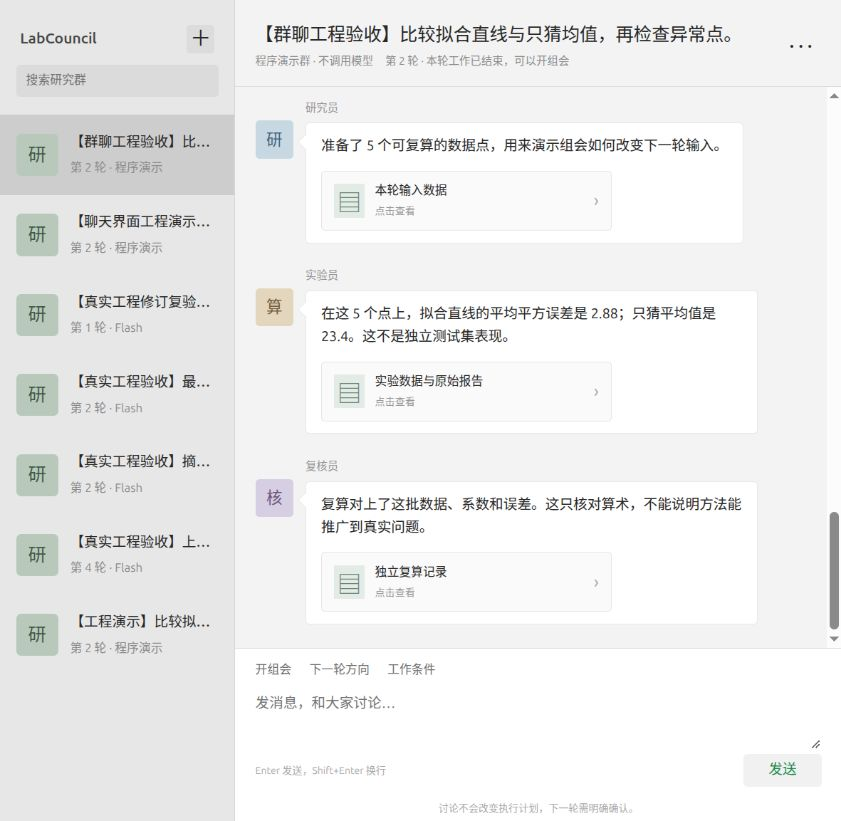

# 微信式研究群验收

2026-10-07。用户指出上一版仍像报告页面，要求微信聊天风格，并明确默认多个 agent 的群聊。

## 这版交互

研究员、实验员、复核员、协调助手使用不同的头像与姓名；用户消息在右侧绿色气泡里，角色消息在左侧白色气泡里。左侧是研究群列表，底部始终是消息输入区。工作条件、规划、实验数据、研究证据和组会材料是可以点开的消息附件；执行设置在辅助弹窗里。

新建群时先发 idea。协调助手逐步询问资源、权限、每天工作时间和额外要求，最后显示确认消息。下一轮带入当前条件，允许沿用、修改、保存草稿或确认。没有把任意一句聊天解释为执行授权。

直接发问题会在没有当前组会时建立当前轮的固定快照，再调用原问答接口；也可显式点击“开组会”。没有当前轮证据时不自动建立空材料问答。已结束的组会保持只读，点击“开组会”回到当前轮次。材料截止与未完成状态可见。

## 实际验收

通过现有 `http://127.0.0.1:8965/` 服务新建“【群聊工程验收】”模拟项目；仅本机固定程序，不调用外网或模型。

- 在群里发送 idea 与资源，选择权限和每日时间，发送额外要求，明确点击“开始工作”。
- 第一轮三个工作角色的报告自动出现，各自有姓名、头像和证据附件。
- 直接发送报告问题，保存组会快照、用户消息和模板答复。
- 点击实验附件，打开通俗报告、具体数值和原始角色证据入口。
- “下一轮方向”逐步修改目标，沿用其他条件，在执行设置选择异常点。
- 保存草稿后仍为第一轮；刷新后恢复完整草稿，在确认消息里继续。
- 确认后第二轮三个任务完成，旧输入、报告、讨论和决定仍在同一个群里。
- 回看第一轮组会时不能发送；点击“开组会”后第二轮输入恢复可用。
- 第二轮组会再次发问题，Enter 发送，第二条模板答复保存；编辑过程经轮询保留文字与焦点。
- 窄屏导航、840px 桌面群列表、头像气泡与输入区可用，DOM 检查均无横向溢出；临时视口设置已恢复。
- `python3 -m unittest discover -s tests -p test_http.py -v`：5 项通过。
- `node --check labcouncil/static/app.js`、`git diff --check` 通过。

[只读数据库核对](state-check.json)：两轮共 6 个完成任务、6 份产物、2 场组会、2 条问答、1 个确认决定；模型和公开来源请求均为 0。截图见下方。

## 实现边界

角色消息来自已有产物与问答记录，未伪造模型报告或成员之间的对话。协调助手的逐步提问是前端固定引导，不是模型动态追问。引导中间消息当前只保留在页面内存；确认后的五项输入与规划、报告、组会讨论、正式决定由原数据库持久保存，已保存的下一轮草稿可刷新恢复。

后台仍为原 simulation / real_case / research 执行器。默认三个角色的工程案例是程序演示；真实研究模式仍是原有界 Flash 工具循环。尚未新增自由群聊、@成员独立回答或多 agent 自主辩论能力。本次验证属于前端与既有流程，不属于科研能力测评。
