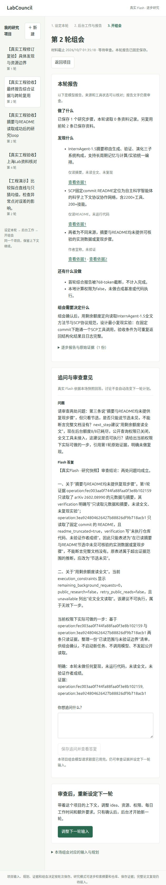

# 组会报告综合证据与跨轮复用

这次修复了一个平台上下文缺口：原prepare_meeting报告只得到“停止等组会”，没有收到此前阅读的原文和工具结果。现在它保存并读取本轮证据和最多3条相关前轮操作，产生具体findings，每条带验证范围和可点击的operation引用。旧证据和失败报告不覆盖。

真实验收并非一路成功：第一轮综合报告被截断；第二轮用原剩余额度成功复用旧证据并生成3条发现；人工审查发现两处语义问题并在组会追问纠正。补充语义和资源边界提示后，唯一追加复验遇到模型传输/响应失败并停止，**最新最终报告提示尚未完成真实复验**。没有把引用检查当作科学正确性验证，也没有执行上游科研实验。

## 结果与投入

| 项目 | 模型请求硬上限与实际 | 公开HTTP | 实际结果 |
|---|---|---:|---|
| 首个两轮工程项目 | 后台8/8，组会1/1 | 4/8 | 2次读取+1次综合报告截断；确认第二轮后生成3条发现，复用2份旧材料；真实QA纠正两处问题 |
| 唯一追加修订复验 | 后台3/6，组会0/0 | 1/8 | 读摘要并报告成功；下一步plan传输/响应失败，未取README、未形成最终报告，停止且不重发 |

合计12次真实模型尝试，11次HTTP200响应（包括1次length截断），1次传输/响应失败。已知23,181 tokens：首项目20,334，追加项目2,847；失败请求usage未知，人民币费用未知。公开读取共5次，均200。原其他项目额度没有增加或重置。

[预注册及逐次修订](PROTOCOL.md)先于对应调用保存；[首项目记录](first-run.json)和[追加复验记录](recheck.json)保留请求状态、usage、finish_reason、原报告、失败、输入、决定和固定快照。首项目截断JSON原文也保存，不能因HTTP200称为成功报告。

## 平台具体改动

- prepare_meeting把非prepare操作编成固定meeting_evidence：本轮全部操作，加最多3条前轮操作；保存原operation ID、原SHA256、轮次、真实工具状态、来源节选以及标为待审查的模型摘要。更早记录仍保留，省略数量明示；提示原文依照15KB输入边界标注节选。
- 工具结果已保存但模型报告失败的操作也能进入综合报告；综合报告失败时，组会QA仍可引用其快照里的原始工具操作。未因缺少模型报告丢失证据。
- findings最多3项，每项finding、verification、evidence_refs；引用只能属于当前固定材料或当前操作，未知引用不通过。普通短步沿用原格式，旧档案没有findings时前端照常显示。
- 最终提示改为简短专用格式，避免与原“500字摘要+多项限制”指令冲突；模型每次仍最多768 tokens，不提高额度。报告前计算本次report之后的剩余请求数，提供当前权限和未接入工具；QA也获取当前实际资源边界。
- 前端沿用“发现什么”，展示具体发现、验证范围和依据链接；区分本轮读取与前轮资料复用，未新增装饰性界面。

## 科学与语义审查

首项目第1轮实际读取InternAgent-1.5摘要（2602.08990v1）与SCP commit `cea5398564032aea65a78e246d06c30ae945e03f` README。摘要不是全文，README给模型的是有限节选，不能对完整内容作缺失判断。

首轮长JSON虽然开始列机制，但在768tokens处截断；还有“单智能体骨架”等未经当前资料支持的表述，全部保留为失败。通过一次明确标注Codex工程确认的组会，第二轮在原剩余2次后台请求内prepare_meeting，引用第一轮两个操作，新增HTTP为0，生成完整报告；并非自动重发旧task。

第二轮报告仍有两处问题：

1. “摘要与README均未提供……复现步骤”把节选观察扩大到整个材料。本轮只能说已给节选未见，不能证明完整README没有步骤。
2. “用剩余额度读全文”忽略后台已经8/8耗尽、public_research=false以及全文工具未接入。提供具体实验想法不等于当前可以执行。

真实组会QA根据保存的原操作和当前execution_constraints明确指出两处问题，给出只整理已读范围与未验证边界的下一步。原报告不改写，纠正在讨论里另存。

后续专用提示明确禁止全文缺失推断、要求普通中文解释机制对目标的用途、根据实际额度和工具做建议。**语义准确性不能靠提示保证**；最新提示的完整最终报告因追加复验连接失败仍待验证。这个失败不能确定为TUN或某个唯一原因，也不是科学复现失败。

## 复查与界面

```bash
python3 reproductions/2026-10-07-meeting-synthesis/audit_saved_run.py
python3 -W error::ResourceWarning -m unittest discover -s tests -v
node --check labcouncil/static/app.js
```

公开记录离线审计通过；只核对保存状态、引用关系、请求上限和用量，不能由删去来源正文的公开导出重建所有原SHA。导出前已在本地逐项对照原operation SHA256。完整来源与模型上下文留忽略的本地数据库，公开文件没有复制完整摘要/README或API密钥。

Python3.11、3.14各68项测试通过（[3.11](tests-python311.txt)、[3.14](tests-python314.txt)）。新增测试覆盖来源真正进入最终提示、前轮证据与缺报告状态、虚假引用拒绝、无证据空发现、长节选边界、报告失败后QA仍引用原材料和投影请求额度。它们是平台测试，不是模型语义准确率测量。

预览使用原8965服务，浏览器展示首项目第二轮组会。截图同时保留原报告的错误与QA审查结果，避免把事后纠正冒充原报告正确：



本轮没有实际用户科研评审，只有Codex工程确认和提问。跨轮成功也不代表论文实验复现或持续多日科研能力已经完成。

下一项：在健康连接下按新小预算复验最新最终提示；同时为一个具体上游实验设计隔离执行与独立核验工具，保留原[工作清单](../../docs/WORKLIST.md)中的其他候选、审批恢复和科研复现任务。已经验证过的SCP本地SDK调用不能重复充当科研结果复现。
